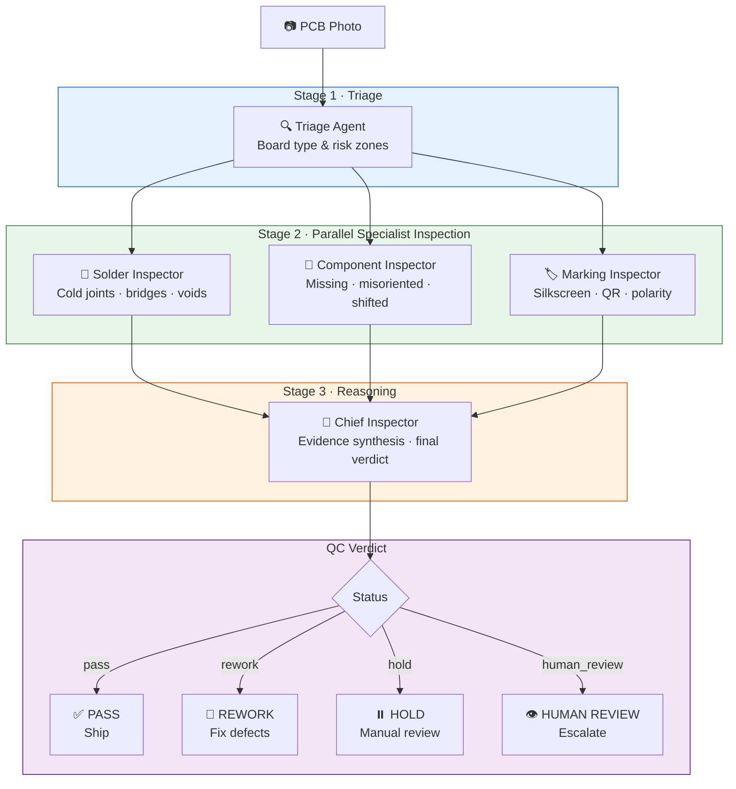

# 🔬 Neuron Vision Display

**Multi-agent visual QC for SMT PCB manufacturing**  
_System: RomeoFlexVision · Google for Startups AI Agents Challenge 2026_

[](https://cloud.google.com/run)
[](https://cloud.google.com/vertex-ai)
[](https://google.github.io/adk-docs/)
[](https://python.org)

---

## The Problem: The Hidden Defect Rate

Electronics manufacturers face a costly blind spot.  
**Visual QC today** relies on trained human inspectors examining boards manually — a process that is slow, inconsistent, and does not scale. Industry averages show **2–5% defect escape rates** from manual inspection lines, costing the average mid-size PCB assembler **$2–8M per year** in warranty returns, field failures, and rework labour.

Automated Optical Inspection (AOI) machines exist but require expensive per-board programming, specialised maintenance staff, and struggle with novel board designs. They are out of reach for the 80% of PCB assemblers who are SMEs.

**Neuron Vision Display** makes the real defect rate visible — with zero per-board programming, using only a smartphone or industrial camera.

---

## Solution: 5-Agent QC Brigade

A brigade of specialised AI agents collaborates to inspect every board:



### Agent Roles

| Agent | Role | Output |
|-------|------|--------|
| **Triage Agent** | Rapid board classification, risk zone mapping | `TriageResult` |
| **Solder Inspector** | Detects cold joints, bridges, insufficient/excess solder | `SolderReport` |
| **Component Inspector** | Checks placement, orientation, missing components | `ComponentReport` |
| **Marking Inspector** | Validates silkscreen, QR codes, polarity marks | `MarkingReport` |
| **Chief Inspector** | Synthesises evidence, issues binding verdict | `QCVerdict` |

---

## Technology Stack

| Layer | Technology |
|-------|-----------|
| **Agent framework** | [Google Agent Development Kit (ADK)](https://google.github.io/adk-docs/) |
| **Vision + reasoning** | Vertex AI **Gemini 2.5 Pro** (us-central1) |
| **Structured output** | Pydantic v2 — all agent outputs are strictly typed |
| **UI** | Streamlit — live agent progress, colour-coded verdict badge, Evidence Log |
| **Deployment** | Cloud Run — serverless, scales to zero |
| **Deploy tooling** | `gcloud` + Cloud Build (`scripts/deploy_cloudrun.sh`) |

---

## Quickstart

### Prerequisites

- Python 3.11+
- A Google Cloud project with Vertex AI API enabled
- `gcloud` CLI authenticated (`gcloud auth application-default login`)

### 1. Clone and install

```bash
git clone https://github.com/your-org/roboqc-agent-challenge
cd roboqc-agent-challenge
pip install -r requirements.txt
```

### 2. Configure environment

```bash
cp .env.example .env
# Edit .env: set GOOGLE_CLOUD_PROJECT=your-project-id
```

### 3. Download sample PCB images (optional)

```bash
bash scripts/download_datasets.sh
# Saves to examples/pcb_samples/
```

### 4. Run the Streamlit UI

```bash
streamlit run app.py
# Opens at http://localhost:8501
```

Upload any PCB photo — the 5-agent brigade analyses it in seconds.

---

## Deploy to Cloud Run

### Prerequisites

- [`gcloud` CLI](https://cloud.google.com/sdk/docs/install) installed and authenticated (`gcloud auth login`)
- [Docker](https://docs.docker.com/get-docker/) installed (used by `gcloud auth configure-docker`)
- A Google Cloud project with **Vertex AI API** enabled
  (`gcloud services enable aiplatform.googleapis.com`)
- A `.env` file with `GOOGLE_CLOUD_PROJECT` set (copy from `.env.example`)

### One-command deploy (recommended)

```bash
./scripts/deploy_cloudrun.sh
```

This reads `GOOGLE_CLOUD_PROJECT` (and optional `GOOGLE_CLOUD_REGION`,
default `us-central1`) from `.env`, configures Docker auth, builds the image
with Cloud Build, deploys to Cloud Run, and prints the service URL.

### Manual deploy

```bash
# Build and push
gcloud builds submit --tag gcr.io/YOUR_PROJECT/neuron-vision-display .

# Deploy
gcloud run deploy neuron-vision-display \
  --image gcr.io/YOUR_PROJECT/neuron-vision-display \
  --platform managed \
  --region us-central1 \
  --allow-unauthenticated \
  --memory 2Gi \
  --cpu 2 \
  --timeout 300 \
  --set-env-vars GOOGLE_CLOUD_PROJECT=YOUR_PROJECT,GOOGLE_CLOUD_REGION=us-central1
```

> The `infra/cloudrun/` directory holds an alternative deploy scaffold
> (`deploy.sh` + `cloudbuild.yaml` + `service.yaml`) for the authenticated
> `roboqc-agent` API service.

---

## Business Case

### Target Customer

SMT PCB assemblers with 50–500 employees who cannot justify a $200K+ AOI machine but are losing $500K–$5M/year to defect escapes and rework costs.

### Value Proposition

| Metric | Manual Inspection | Neuron Vision Display |
|--------|-----------------|----------------------|
| Inspection time per board | 3–8 min | **8–25 sec** |
| Defect escape rate | 2–5% | **< 0.5% (target)** |
| Per-board programming | Required | **Zero** |
| Scales with volume | No | **Yes** |
| Provides audit trail | Rarely | **Always** |

### Revenue Model

SaaS pricing per board inspected: **$0.02–$0.10 per board** depending on volume tier.  
A 100K boards/month customer = $2K–$10K MRR at minimal infrastructure cost.

---

## Project Structure

```
roboqc-agent-challenge/
├── app.py                          # Streamlit UI (production)
├── requirements.txt
├── Dockerfile
├── .env.example
├── src/
│   ├── neuron_vision/              # ← New 5-agent brigade
│   │   ├── __init__.py
│   │   ├── schemas.py              # Pydantic v2 models
│   │   ├── pipeline.py             # Orchestrator
│   │   └── agents/
│   │       ├── base.py             # NeuronVisionAgent base class
│   │       ├── triage_agent.py
│   │       ├── solder_inspector.py
│   │       ├── component_inspector.py
│   │       ├── marking_inspector.py
│   │       └── chief_inspector.py
│   └── [existing ADK pipeline]     # Original 4-agent tile pipeline
├── scripts/
│   ├── download_datasets.sh        # DeepPCB · VisA · PKU-Market-PCB
│   └── deploy_cloudrun.sh          # One-command Cloud Run deploy
├── examples/
│   └── pcb_samples/                # Sample images for demo
├── infra/
│   └── cloudrun/                   # Alt deploy scaffold (roboqc-agent API)
└── docs/
    └── architecture.md
```

---

## Datasets

The `scripts/download_datasets.sh` script downloads three public, research-licensed PCB datasets:

- **[DeepPCB](https://github.com/tangsanli5201/DeepPCB)** — 1,500 paired defect images, Peking University
- **[VisA (PCB1/PCB2)](https://github.com/amazon-science/spot-diff)** — Visual anomaly benchmark, Amazon Science
- **[PKU-Market-PCB](https://robotics.pkusz.edu.cn/resources/dataset/)** — Market-survey PCB defect set

All datasets are publicly available for research and non-commercial use.

---

## Licence

MIT — see [LICENSE](LICENSE)

---

_Built for the Google for Startups AI Agents Challenge 2026 · Team RomeoFlexVision_
