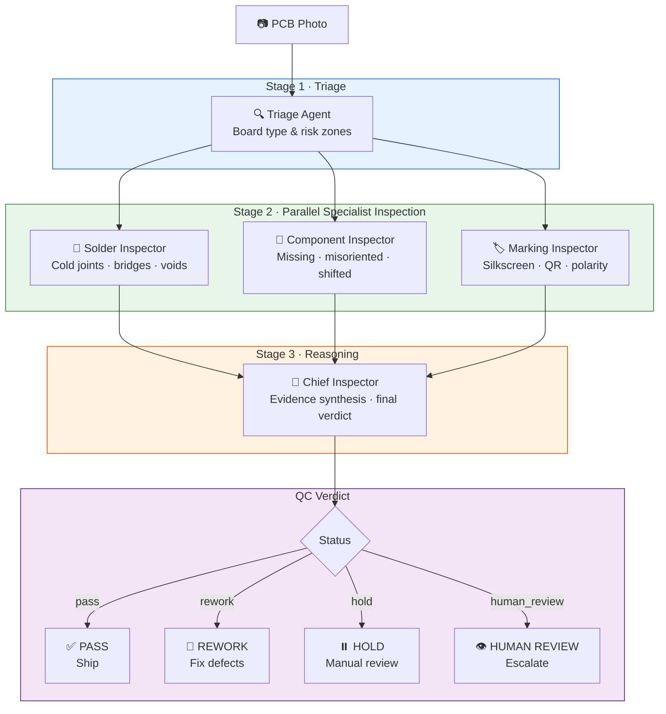

# RoboQC Agent

**5-agent visual QC for SMT PCB manufacturing**  
_Live system: Neuron Vision Display · Team RomeoFlexVision · Google for Startups AI Agents Challenge 2026_

[](https://cloud.google.com/run)
[](https://cloud.google.com/vertex-ai)
[](https://google.github.io/adk-docs/)
[](https://phoenix.arize.com/)
[](https://python.org)

---

## Submission Links

- **Live demo:** https://neuron-vision-display-z3mwyxcila-uc.a.run.app
- **Final video:** add YouTube/Vimeo unlisted URL after final upload
- **Devpost copy:** [docs/devpost_submission.md](docs/devpost_submission.md)
- **Demo run-of-show:** [docs/demo.md](docs/demo.md)
- **Submission audit:** [docs/submission_audit.md](docs/submission_audit.md)
- **Video upload metadata:** [docs/video_upload.md](docs/video_upload.md)
- **Narrated video candidate:** [assets/video/roboqc_demo_narrated_3min.mp4](assets/video/roboqc_demo_narrated_3min.mp4)
- **Upload thumbnail:** [assets/video/roboqc_youtube_thumbnail.png](assets/video/roboqc_youtube_thumbnail.png)
- **Silent draft video:** [assets/video/roboqc_demo_draft_3min.mp4](assets/video/roboqc_demo_draft_3min.mp4)
- **Higgsfield source clips:** [assets/source/higgsfield](assets/source/higgsfield)
- **Video frames:** [assets/video_frames](assets/video_frames)
- **Architecture frame:** [assets/video_frames/frame_09_architecture.png](assets/video_frames/frame_09_architecture.png)

Local final-check gate:

```bash
python scripts/verify_submission.py --run-pytest
```

After upload, patch the final YouTube/Vimeo URL into README and [docs/devpost_submission.md](docs/devpost_submission.md):

```bash
python scripts/set_final_video_url.py "https://YOUR_UNLISTED_VIDEO_URL"
```

Then run the strict gate:

```bash
python scripts/verify_submission.py --run-pytest --strict-final
```


---

## The Problem: The Hidden Defect Rate

Electronics manufacturers face a costly blind spot.  
**Visual QC today** relies on trained human inspectors examining boards manually — a process that is slow, inconsistent, and does not scale. Industry averages show **2–5% defect escape rates** from manual inspection lines, costing the average mid-size PCB assembler **$2–8M per year** in warranty returns, field failures, and rework labour.

Automated Optical Inspection (AOI) machines exist but require expensive per-board programming, specialised maintenance staff, and struggle with novel board designs. They are out of reach for the 80% of PCB assemblers who are SMEs.

**Neuron Vision Display** makes the real defect rate visible — with zero per-board programming, using only a smartphone or industrial camera.

---

## Solution: 5-Agent QC Brigade

A brigade of specialised AI agents collaborates to inspect every board:



### Agent Roles

| Agent | Role | Output |
|-------|------|--------|
| **Triage Agent** | Rapid board classification, risk zone mapping | `TriageResult` |
| **Solder Inspector** | Detects cold joints, bridges, insufficient/excess solder | `SolderReport` |
| **Component Inspector** | Checks placement, orientation, missing components | `ComponentReport` |
| **Marking Inspector** | Validates silkscreen, QR codes, polarity marks | `MarkingReport` |
| **Chief Inspector** | Synthesises evidence, issues binding verdict | `QCVerdict` |

---

## Production Runtime Boundary

The deployed Cloud Run application is [app.py](app.py), which imports the
`src/neuron_vision` package and calls Vertex AI through:

```python
from vertexai.generative_models import GenerativeModel
```

That production path is the 5-agent Neuron Vision Display pipeline shown above.
It is the only runtime path used by the live Streamlit UI and by the Arize
OpenInference instrumentation.

The repository also keeps the earlier `src/roboqc_agent` Google ADK scaffold for
tests and future API work. That legacy scaffold contains a `google-genai`
provider, but it is not executed by the deployed Cloud Run Streamlit service.

---

## Technology Stack

| Layer | Technology |
|-------|-----------|
| **Agent architecture** | Typed 5-agent runtime + [Google ADK](https://google.github.io/adk-docs/) graph scaffold |
| **Vision + reasoning** | Vertex AI **Gemini 2.5 Pro** (us-central1) |
| **Deep causal reasoning** | **Claude Fable 5** (Anthropic) with Opus 4.8 fallback — see [docs/fable5_integration.md](docs/fable5_integration.md) |
| **Structured output** | Pydantic v2 — all agent outputs are strictly typed |
| **UI** | Streamlit — live agent progress, colour-coded verdict badge, Evidence Log |
| **Observability** | Arize Phoenix + OpenTelemetry + `openinference-instrumentation-vertexai` |
| **Deployment** | Cloud Run — 2 vCPU / 2Gi, min instances during judging |
| **Deploy tooling** | `gcloud` + Cloud Build (`scripts/deploy_cloudrun.sh`) |

---

## Claude Fable 5 — Deep Reasoning Engine

Root-cause analysis and engineering recommendations are powered by **Claude Fable 5**
(`claude-fable-5`, 1M-token context) through two integration paths:

1. **Cloud Run service** (`src/neuron_vision/fable5/`) — FastAPI endpoints
   `/analyze-defect`, `/root-cause`, `/recommendations` calling the Anthropic Messages API
   with structured output (JSON Schema), adaptive thinking and graceful fallback to
   Claude Opus 4.8 on refusal/rate-limit/timeout.
2. **Vertex AI Agent Builder custom tool** (`infra/fable5/agent_builder_tool.json`) for
   conversational agents: the OpenAPI tool spec points Agent Builder at the deployed
   Cloud Run service, so an agent answers "why is this happening?" by POSTing the
   structured defect batch to `/analyze-defect` and narrating the returned root-cause
   JSON. System prompt for that agent: `infra/fable5/agent_builder_system_prompt.md`;
   the spec is registered as a custom tool in the Agent Builder console (Tools → OpenAPI).

The Anthropic API key lives only in **Google Cloud Secret Manager**; every call is logged
to Cloud Logging with token usage and per-call cost estimates. Setup, IAM, deploy and
monitoring: [docs/fable5_integration.md](docs/fable5_integration.md).

---

## Observability — Arize Phoenix

Neuron Vision Display instruments Vertex AI Gemini calls through OpenInference and
exports spans to Arize Phoenix / Arize Cloud-compatible OTLP endpoints.

**SDK note:** the live pipeline uses:

```python
from vertexai.generative_models import GenerativeModel
```

So the correct instrumentation package is:

```txt
openinference-instrumentation-vertexai
```

not `openinference-instrumentation-google-genai`, which targets the separate
`google-genai` SDK.

Tracing is initialized in [src/neuron_vision/telemetry.py](src/neuron_vision/telemetry.py):

```python
from openinference.instrumentation.vertexai import VertexAIInstrumentor

VertexAIInstrumentor().instrument()
```

The pipeline also creates a parent span around the full inspection run and
agent-level spans for Triage, Solder, Component, Marking, and Chief. Stage 2
uses explicit ContextVar propagation through `run_in_executor`, so Phoenix can
show the three specialist agents as a parallel bracket under one inspection.

Cloud Run configuration:

```bash
PHOENIX_COLLECTOR_ENDPOINT=https://YOUR-PHOENIX-OR-ARIZE-ENDPOINT/v1/traces
PHOENIX_API_KEY=YOUR_PHOENIX_API_KEY
PHOENIX_PROJECT_NAME=neuron-vision-display
DEMO_MODE=0
GOOGLE_CLOUD_PROJECT=YOUR_PROJECT
GOOGLE_CLOUD_REGION=us-central1
```

For Phoenix/Arize endpoints with authentication enabled, the app reads
`PHOENIX_API_KEY` and sends it as the OTLP HTTP `authorization: Bearer ...`
header. It also sets `x-project-name` so traces route to the
`neuron-vision-display` project in Phoenix/Arize.

If `PHOENIX_COLLECTOR_ENDPOINT` is missing on Cloud Run, the app still serves
traffic, but traces are not exported to an external Phoenix/Arize collector.

---

## Quickstart

### Prerequisites

- Python 3.11+
- A Google Cloud project with Vertex AI API enabled
- `gcloud` CLI authenticated (`gcloud auth application-default login`)

### 1. Clone and install

```bash
git clone https://github.com/aleksandrlyubarev-blip/roboqc-agent-challenge
cd roboqc-agent-challenge
pip install -r requirements.txt
```

### 2. Configure environment

```bash
cp .env.example .env
# Edit .env: set GOOGLE_CLOUD_PROJECT=your-project-id
```

### 3. Download sample PCB images (optional)

```bash
bash scripts/download_datasets.sh
# Saves to examples/pcb_samples/
```

### 4. Run the Streamlit UI

```bash
streamlit run app.py
# Opens at http://localhost:8501
```

Upload any PCB photo — the 5-agent brigade analyses it in seconds.

---

## Deploy to Cloud Run

### Prerequisites

- [`gcloud` CLI](https://cloud.google.com/sdk/docs/install) installed and authenticated (`gcloud auth login`)
- [Docker](https://docs.docker.com/get-docker/) installed (used by `gcloud auth configure-docker`)
- A Google Cloud project with **Vertex AI API** enabled
  (`gcloud services enable aiplatform.googleapis.com`)
- A `.env` file with `GOOGLE_CLOUD_PROJECT` set (copy from `.env.example`)

### One-command deploy (recommended)

```bash
./scripts/deploy_cloudrun.sh
```

This reads `GOOGLE_CLOUD_PROJECT` (and optional `GOOGLE_CLOUD_REGION`,
default `us-central1`) from `.env`, configures Docker auth, builds the image
with Cloud Build, deploys to Cloud Run, and prints the service URL.

### Manual deploy

```bash
# Build and push
gcloud builds submit --tag gcr.io/YOUR_PROJECT/neuron-vision-display .

# Deploy
gcloud run deploy neuron-vision-display \
  --image gcr.io/YOUR_PROJECT/neuron-vision-display \
  --platform managed \
  --region us-central1 \
  --allow-unauthenticated \
  --memory 2Gi \
  --cpu 2 \
  --concurrency 4 \
  --min-instances 1 \
  --max-instances 10 \
  --timeout 300 \
  --set-env-vars GOOGLE_CLOUD_PROJECT=YOUR_PROJECT,GOOGLE_CLOUD_REGION=us-central1,DEMO_MODE=0,PHOENIX_COLLECTOR_ENDPOINT=https://YOUR-PHOENIX-ENDPOINT/v1/traces
```

### Attach Arize/Phoenix to an existing Cloud Run service

```bash
gcloud run services update neuron-vision-display \
  --region us-central1 \
  --update-env-vars PHOENIX_COLLECTOR_ENDPOINT=https://YOUR-PHOENIX-ENDPOINT/v1/traces,PHOENIX_API_KEY=YOUR_PHOENIX_API_KEY,PHOENIX_PROJECT_NAME=neuron-vision-display
```

Keep `--min-instances 1` enabled through judging to avoid a cold start on the
first visit. You can remove it after the judging window to return to scale-to-zero.

> The `infra/cloudrun/` directory holds an alternative deploy scaffold
> (`deploy.sh` + `cloudbuild.yaml` + `service.yaml`) for the authenticated
> `roboqc-agent` API service.

---

## Business Case

### Target Customer

SMT PCB assemblers with 50–500 employees who cannot justify a $200K+ AOI machine but are losing $500K–$5M/year to defect escapes and rework costs.

### Value Proposition

| Metric | Manual Inspection | Neuron Vision Display |
|--------|-----------------|----------------------|
| Inspection time per board | 3–8 min | **8–25 sec** |
| Defect escape rate | 2–5% | **< 0.5% (target)** |
| Per-board programming | Required | **Zero** |
| Scales with volume | No | **Yes** |
| Provides audit trail | Rarely | **Always** |

### Revenue Model

SaaS pricing per board inspected: **$0.02–$0.10 per board** depending on volume tier.  
A 100K boards/month customer = $2K–$10K MRR at minimal infrastructure cost.

---

## Project Structure

```
roboqc-agent-challenge/
├── app.py                          # Streamlit UI (production)
├── requirements.txt
├── Dockerfile
├── .env.example
├── src/
│   ├── neuron_vision/              # ← New 5-agent brigade
│   │   ├── __init__.py
│   │   ├── schemas.py              # Pydantic v2 models
│   │   ├── pipeline.py             # Orchestrator
│   │   ├── telemetry.py            # Arize Phoenix / OpenInference tracing
│   │   └── agents/
│   │       ├── base.py             # NeuronVisionAgent base class
│   │       ├── triage_agent.py
│   │       ├── solder_inspector.py
│   │       ├── component_inspector.py
│   │       ├── marking_inspector.py
│   │       └── chief_inspector.py
│   └── roboqc_agent/               # Legacy ADK/API scaffold, not live Streamlit runtime
├── scripts/
│   ├── download_datasets.sh        # DeepPCB · VisA · PKU-Market-PCB
│   ├── deploy_cloudrun.sh          # One-command Cloud Run deploy
│   ├── generate_video_frames.py    # Deterministic 1280×720 demo frames
│   ├── build_demo_video.py         # Silent + narrated 3-minute video assembly
│   ├── set_final_video_url.py      # Patch uploaded video URL into docs
│   └── verify_submission.py        # Local final-check gate before Devpost submit
├── assets/
│   ├── source/higgsfield/          # Higgsfield production-footage source clips
│   ├── video_frames/               # Submission video stills and architecture frame
│   └── video/                      # 3-minute MP4 candidate, subtitles, voiceover text
├── examples/
│   └── pcb_samples/                # Sample images for demo
├── infra/
│   └── cloudrun/                   # Alt deploy scaffold (roboqc-agent API)
└── docs/
    └── architecture.md
```

---

## Datasets

The `scripts/download_datasets.sh` script downloads three public, research-licensed PCB datasets:

- **[DeepPCB](https://github.com/tangsanli5201/DeepPCB)** — 1,500 paired defect images, Peking University
- **[VisA (PCB1/PCB2)](https://github.com/amazon-science/spot-diff)** — Visual anomaly benchmark, Amazon Science
- **[PKU-Market-PCB](https://robotics.pkusz.edu.cn/resources/dataset/)** — Market-survey PCB defect set

All datasets are publicly available for research and non-commercial use.

---

## Licence

MIT — see [LICENSE](LICENSE)

---

_Built for the Google for Startups AI Agents Challenge 2026 · Team RomeoFlexVision_
